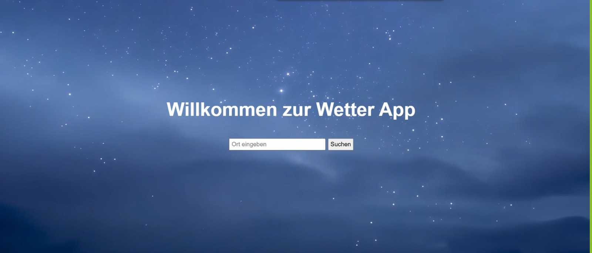
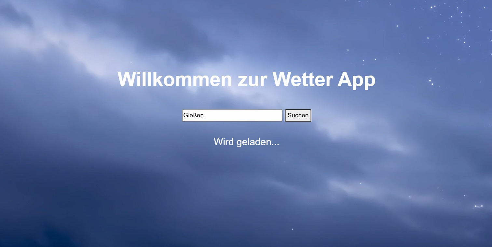
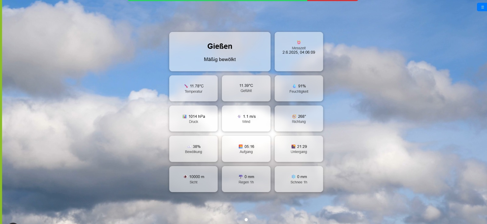
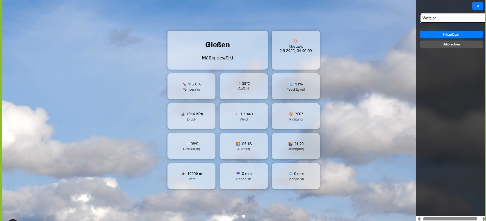

# WetterApp
Cloud-native Microservice-Anwendung zur Erfassung, Speicherung und Visualisierung von Wetterdaten für verschiedene Standorte. Die App besteht aus einer Svelte-Weboberfläche, einem Express.js-Backend und nutzt Supabase für Datenhaltung.

## Funktionen
- Standorte hinzufügen und verwalten
- Wetterdaten automatisch per API abrufen (OpenWeatherMap)
- Daten tabellarisch und grafisch anzeigen
- Supabase als zentrale Datenbank mit REST-Zugriff
- Collector-Dienste manuell steuerbar (Start/Stop/Status)
- Integration mit GitLab CI/CD zur Qualitätssicherung


## Technologien

| Bereich | Technologie |
|---|---|
| Frontend | Svelte |
| Backend | Express.js / Node.js |
| Datenhaltung | Supabase / PostgreSQL |
| Datenquelle | OpenWeatherMap API |
| Containerisierung | Docker / Docker Compose |
| Deployment | Ansible |
| CI/CD | GitLab CI/CD |
| Codequalität | SonarQube |
| Versionsverwaltung | Git |
| Große Dateien | Git LFS |


## ProjektStruktur 
wetterapp/
├── frontend/ # Svelte Web-App
├── backend/ # Express API + Collector Services
├── .gitlab-ci.yml # CI/CD-Konfiguration
├── Dokumentation
└── README.md

## Visuelle Darstellung 






## Code formatierung und prüfen
npm run lint
npm run format

## Installation

### Voraussetzungen

Für die lokale Ausführung werden unter anderem folgende Werkzeuge benötigt:

- Node.js
- npm
- Git
- Git LFS
- Docker und Docker Compose

### Repository klonen

```bash
git clone https://github.com/dala43/WetterApp.git
cd WetterApp
```

Da einige Wetteranimationen aufgrund ihrer Dateigröße mit Git LFS verwaltet werden, sollte Git LFS nach dem Klonen initialisiert und die Dateien heruntergeladen werden:

```bash
git lfs install
git lfs pull
```

### Frontend installieren und starten

```bash
cd frontend
npm install
npm run dev
```

### Backend starten

In einem zweiten Terminal:

```bash
cd backend
node index.js
```


## Ausführen der App
- nach der Installation 
- geht auf dem Browser 
- gibt eine Stadt in der Suchfeld
- danach suchen Button eintippen
- die Visuale und Grafische wetter Daten interpretieren

## Git LFS

Die Wetteranimationen im Verzeichnis `frontend/static/` werden aufgrund ihrer Dateigröße mit **Git Large File Storage (Git LFS)** verwaltet.

Aktuell werden folgende Dateien mit Git LFS verwaltet:

- `frontend/static/Hintergrund.mp4`
- `frontend/static/gewitter.mp4`
- `frontend/static/regen.mp4`
- `frontend/static/schnee.mp4`
- `frontend/static/sonne.mp4`
- `frontend/static/wolken.mp4`

Nach dem Klonen des Repositorys können die Dateien mit folgendem Befehl heruntergeladen werden:

```bash
git lfs pull
```

## CI/CD

Das Projekt enthält eine GitLab-CI/CD-Konfiguration.

Die Pipeline ist in folgender Datei definiert:

```text
.gitlab-ci.yml
```

Die CI/CD-Umgebung unterstützt unter anderem die automatisierte Qualitätssicherung des Projekts.

## Dokumentation

Weitere Informationen zur Architektur, Bereitstellung und Ausführung der Anwendung befinden sich im Verzeichnis:

```text
Dokumentation/
```

Zusätzlich steht eine Dokumentation zur Bereitstellung der Cloud-Native Application mit Docker und Docker Compose zur Verfügung.


## Quellen für Hintergrundvideos
Sonne:
https://de.freepik.com/gratis-video/schoener-blauer-himmel-mit-flauschigen-weissen-wolken_3417148
https://videocdn.cdnpk.net/videos/a70dc658-c7e5-56f4-9d9e-bfdb906b7a9f/horizontal/downloads/original.mp4?filename=0_Blue_Sky_White_Clouds_3840x2160.mp4

Wolken:
https://de.freepik.com/search?format=search&last_filter=type&last_value=video&query=weather&type=video
https://videocdn.cdnpk.net/videos/de56c1c2-524e-549f-9012-e794b996379c/horizontal/downloads/4k.mp4?filename=0_Clouds_Sky_3840x2160.mp4

Regen:
https://www.pexels.com/de-de/suche/videos/regen/
https://videos.pexels.com/video-files/856186/856186-hd_1920_1080_30fps.mp4

Schnee:
https://videocdn.cdnpk.net/videos/d9841bf0-2aa9-4526-aa59-b6c4bb966fea/horizontal/previews/clear/large.mp4

Hintergrund:
https://videocdn.cdnpk.net/videos/9a57b108-67d5-5334-aa7c-2128f0af8b7b/horizontal/previews/clear/large.mp4

Gewitter:
https://www.pexels.com/de-de/suche/videos/gewitter/
https://videos.pexels.com/video-files/2657691/2657691-hd_1920_1080_30fps.mp4


## Unterstützung bei der Dokumentation

Bei der Strukturierung und sprachlichen Ausarbeitung der Projektdokumentation wurde **ChatGPT** unterstützend eingesetzt.

Die technische Umsetzung, Konfiguration und Projektdokumentation wurden durch die Projektgruppe erarbeitet und überprüft.

## Autoren

- **Dania Al Aji**
- **Eman Kara Ali**
- **Tchenou Chimi Julienne Malvina**

## Projektstatus

Das Projekt wurde im Rahmen einer Gruppenarbeit an der **Technischen Hochschule Mittelhessen (THM)** entwickelt.

Der Schwerpunkt liegt auf der praktischen Umsetzung einer cloud-nativen Microservice-Anwendung mit Wetterdaten, Containerisierung, CI/CD, automatisierter Bereitstellung und dokumentierter Softwareentwicklung.
